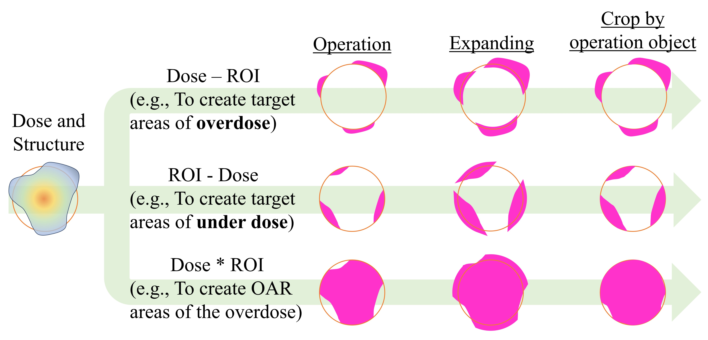
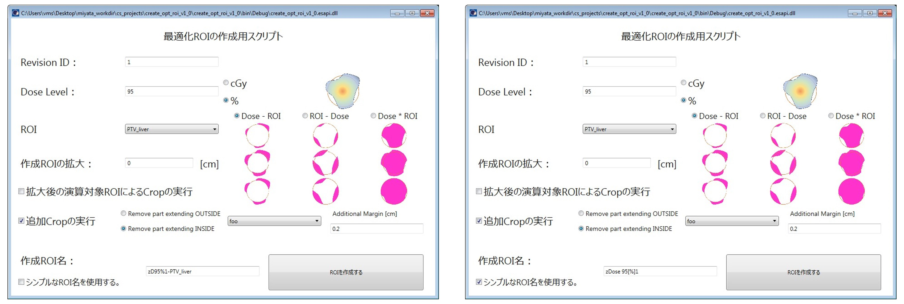
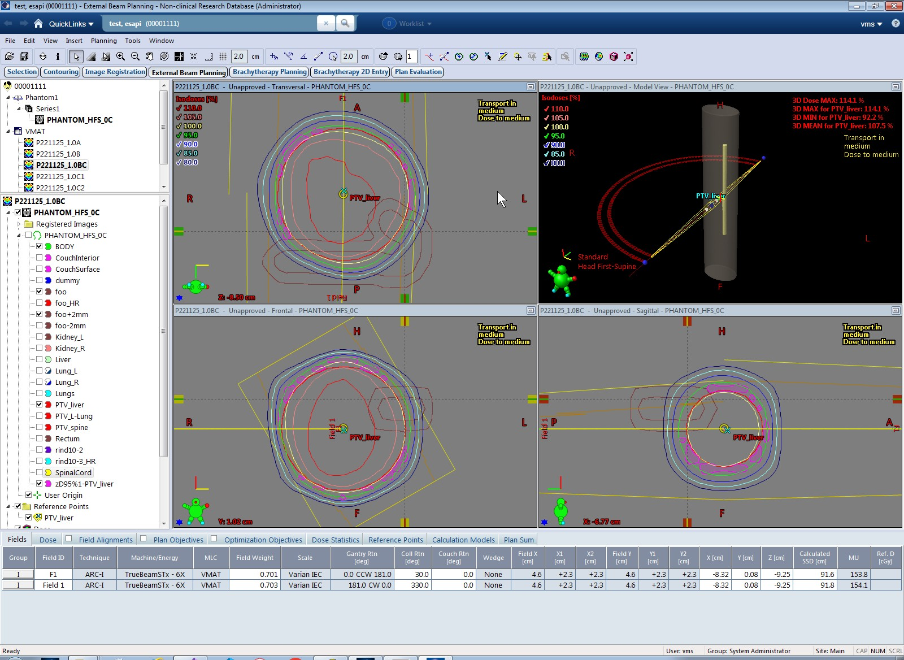

# create_opt_roi_esapi_v15_5

ESAPI Binary Plugin for creating optimization ROIs during planning.

It creates a Structure of an arbitrary dose and calculates it with an arbitrary Structure.

This is in the process of i8n.

## Operation flow

As shown in the figure below, a Structure for an arbitrary dose in the dose distribution is created and logical difference (NOT) or logical product (AND) is taken with an arbitrary Structure.

Afterwards, expand and crop the generated Structure arbitrarily.

## How to use

Suppose the plan you want to process is shown below.

Run create_opt_roi_esapi_v15_5.esapi.dll from Tools > Scripts.

If "シンプルな ROI 名を使用する (Use simple ROI name)" is checked, the generated Structure will be given the same name as when "Convert Isodose Level to Structure" is executed in Eclipse.

If not checked, the specified "Dose" and "ROI ID for operation" will be filled in the Structure name.

**If the generated Structure name is an invalid name, a function that prevents the button from being pressed was implemented, but because a crash occurred when this Binary Plugin was run for the first time for each Patient, so the button can be pressed at any time now.**

**Note, however, that a MessageBox is displayed in the case of invalid naming, informing the user that the Structure cannot be added.**

The Structure generated with the above input values is shown in the figure below.

### Setup

Dose units and naming rules can be specified in [create_opt_roi_parameters.csv](https://github.com/akiaji-k/create_opt_roi_esapi_v15_5/blob/main/create_opt_roi_parameters.csv), which are set immediately after start-up.

## LICENSE

Released under the MIT license.

No responsibility is assumed for anything that occurs with this software.

See [LICENSE](https://github.com/akiaji-k/plan_checker_gui_esapi_v15_5/blob/main/LICENSE) for further details.

