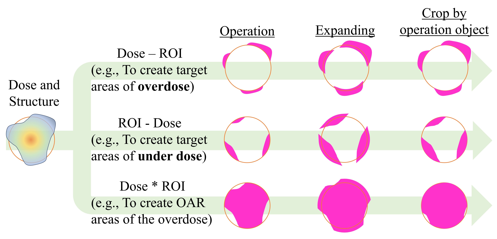
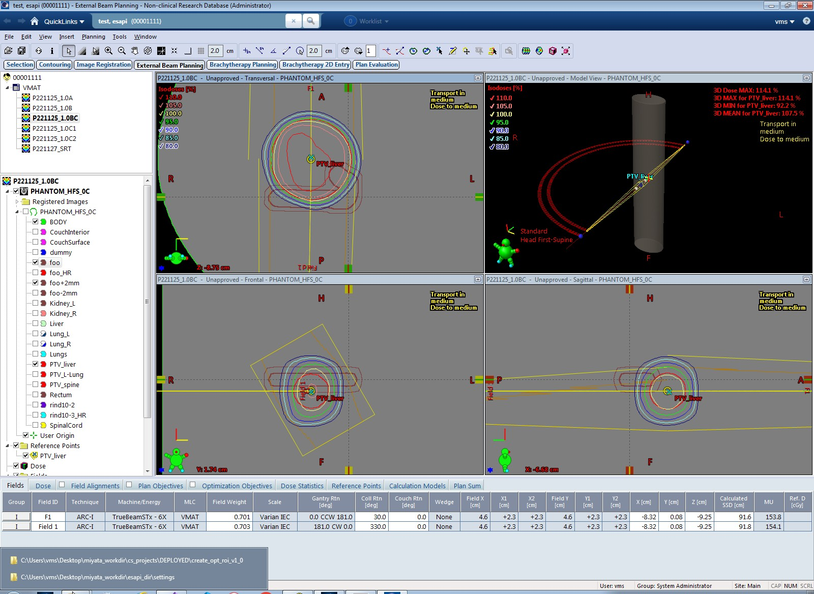
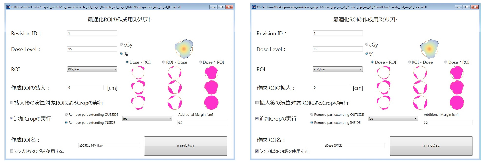
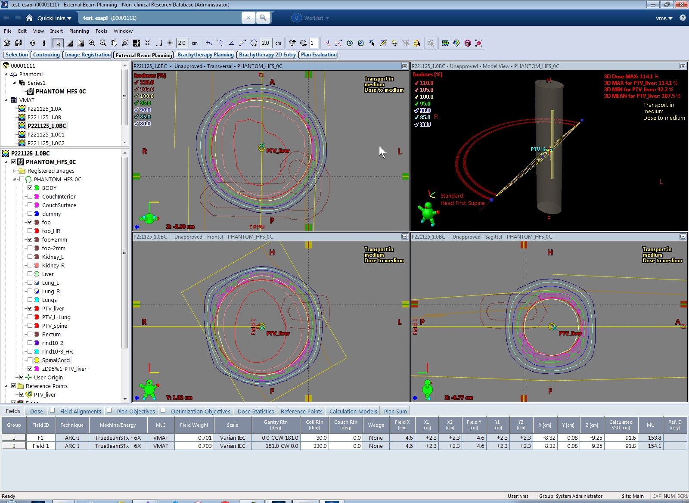

# create_opt_roi_esapi_v15_5

プラン作成中の最適化用 ROI を作成するための ESAPI Binary Plugin です。

任意の線量の Structure を作成し、任意の Structure と演算します。

本ソフトウェアの多言語への翻訳は途中です。

## 動作の流れ

下図に示すように、線量分布の任意の線量の Structure を作成し、任意の Structure と論理差 (NOT)、論理積 (AND) をとります。

その後、生成した Structure に対して、任意で拡大、Crop を行います。

## 使用方法

処理したいプランを仮に下図とします。

Tools > Scripts から create_opt_roi_esapi_v15_5.esapi.dll を実行します。

"シンプルな ORI 名を使用する" にチェックを入れた場合、生成する Structure には Eclipse で "Convert Isodose Level to Structure" を実行した際と同様の名前を付けます。

チェックを入れない場合、指定した "線量" と "演算対象の ROI ID" をStructure 名に入力します。

**生成する Structure 名が不正な命名の場合、ボタンを押せなくなる機能を実装していましたが、各 Patient の本 Binary Plugin 初回起動時にクラッシュする事案が発生したため、ボタンは常に押せるようにしています。**

**ただし、不正な命名の場合 Message Box が表示されて Structure を追加できない旨が通知されます。**

上記の設定で生成した Structure は下図に示す通りです。

### 設定方法

[create_opt_roi_parameters.csv](https://github.com/akiaji-k/create_opt_roi_esapi_v15_5/blob/main/create_opt_roi_parameters.csv) ファイルで起動直後の線量単位、命名規則を指定可能。

## ライセンス

MIT ライセンスで公開されています。

本ソフトウェアで発生したことについて、いかなる責任も負いません。

詳細は [LICENSE](https://github.com/akiaji-k/plan_checker_gui_esapi_v15_5/blob/main/LICENSE) をご確認ください。

